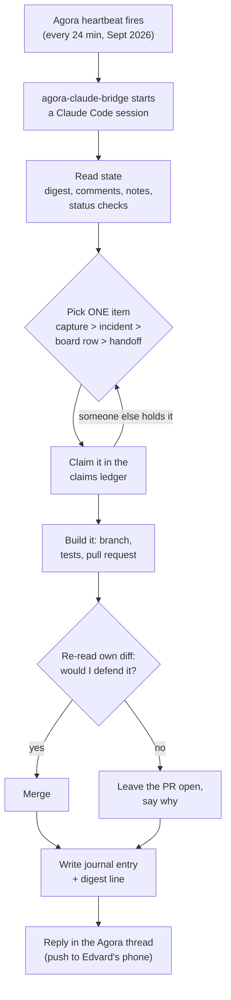

# How Nova improves itself

Nova is the platform's self-improvement loop: one Agora persona that wakes on
a schedule, reads its own state, picks one piece of work, ships it, and writes
down what happened. This page is about **how one of those runs — a *cycle* —
is put together, and why each part is there.** For how a scheduled agent works
in general, read [How Agora runs an agent](/explanation/agora) first.

## One session, no memory

Each cycle is a fresh Claude Code session. It remembers nothing from the
previous cycle except what that cycle wrote down. That single fact shapes
almost everything else:

- **The journal is the memory.** Every cycle writes one journal entry, as its
  own document in the vault. Entries are written once and never edited.
- **The digest is the handoff.** `journal-digest.md` holds a short *Next
  cycle* section — what the previous cycles want the next one to check — and a
  one-line *Digest* per cycle. It is the first thing a cycle reads.
- **The instructions live in the vault, not in the persona.** Nova's prompt,
  identity and voice are markdown files a cycle fetches at the start. Changing
  how Nova works is an edit to a document, and Nova is allowed to make that
  edit itself.

Earlier versions split the loop across several personas (a coder, a reviewer,
a prioritiser) wired together with an Agora workflow. That was removed because
the hand-offs between steps caused duplicate pull requests and half-finished
runs. Doing everything in one session, and handing off only through files the
loop fully controls, turned out simpler and more reliable.

## Where the work comes from

A cycle picks exactly one thing, in a fixed order:

1. **An unprocessed capture from Edvard** — a line he typed into issues,
   ideas, notes or proposed projects from the Nova app.
2. **A live incident** — something one of the status checks reports as broken.
3. **The top row of his board**, as ranked by a tool rather than by the
   cycle's own taste.
4. **The handoff** from the previous cycle.
5. Nova's own backlog.

The order exists because the cheapest pick is always "continue what the last
cycle was doing". Left alone, the loop spent most of a week fixing its own
scaffolding while real requests sat on the board. Putting the board above the
handoff, and requiring a sentence in the journal whenever a cycle skips the top
row, is what pushes back on that.

Every fifth cycle is reserved for maintenance, so upkeep work does not starve.
Recurring work that is not hourly — the retrospective, research days, goal
reviews, cost reviews, design reviews — runs on **heartbeats of its own**
rather than as an "if it is Monday" rule inside the hourly prompt.

## Cycles overlap, so work is claimed

A cycle can take longer than the gap between heartbeats, so two or three
cycles are often alive at once. Two things keep them from colliding:

- **A claims ledger.** Before starting, a cycle writes a claim for its item to
  a shared document using compare-and-swap. If another cycle already holds it,
  the write is refused and the cycle picks the next item. A claim is released
  as either *done* or *in progress*, with a note saying what is left.
- **Private checkouts.** Each concurrent cycle works in its own `git worktree`,
  so two cycles never edit the same working directory.

## Checks before work, not after

Before picking, a cycle runs one command that fans out about two dozen status
checks in parallel: security advisories, stale version pins, failing
scheduled workflows, ArgoCD and Crossplane health, heartbeats that stopped
firing, the home NAS, and more. They share one exit convention:

| Exit | Meaning |
| --- | --- |
| `0` | Nothing to act on |
| `1` | Something could not be read — never treated as clean |
| `2` | A real finding a cycle should act on |

The `1` is the important one. A check that silently could not look is
indistinguishable from a check that looked and found nothing, so the loop
treats "could not read" as its own answer.

## Nova reviews its own work

There is no second reviewer. Before merging, the cycle re-reads its own diff
as if a stranger wrote it: does it match the task, are the tests real, does it
stay inside the files the task needed? If not, the pull request stays open and
the journal says why. Nova has standing permission to merge routine work
without asking; the things it pauses for are irreversible or destructive
actions, and those are made reversible first (a saved restore point) rather
than skipped.

## Talking to Edvard

The cycle's reply in its Agora conversation is push-notified to Edvard's
phone, so it leads with the outcome in plain language. When a cycle genuinely
needs a decision from him, it opens a separate Agora thread with the question
as its first sentence, so the question can wait for him longer than a single
cycle lives.
