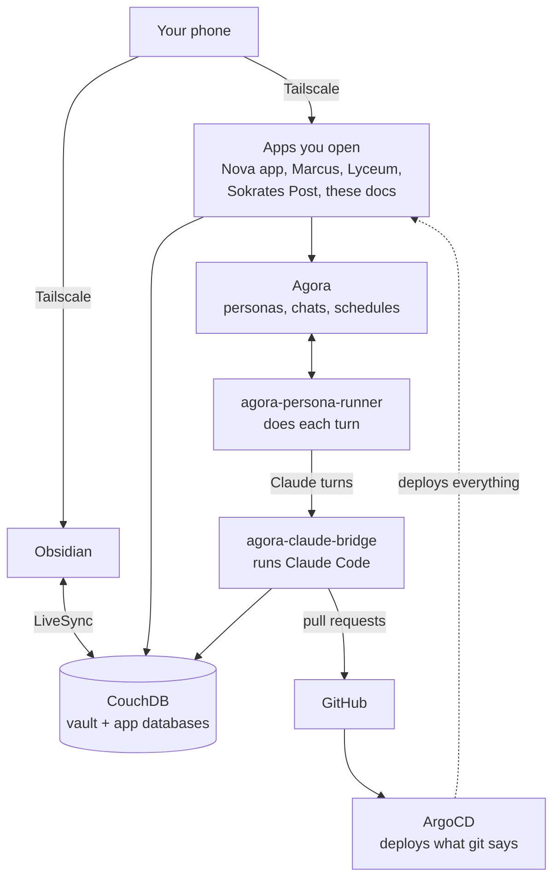
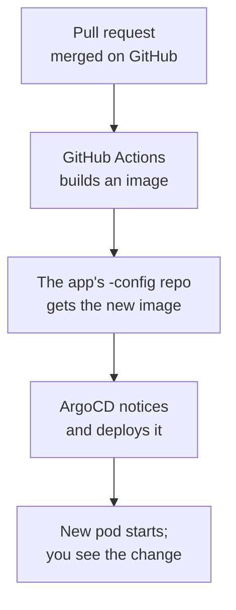

# What the platform is made of

This page is the map. It names the parts of the Sokrates platform you will meet, says what each one is for, and shows how they connect. Start here, then read the other explanation pages for the parts you want to understand in depth.

The parts, machines and disks below were read off the live cluster on 2026-09-22. Names and counts change; the shape changes much more slowly.

## The whole thing in one picture

Read it top to bottom: you open an app on your phone, the app talks to Agora and to the database, Agora hands a turn to the runner, the runner hands Claude turns to the bridge, and the bridge is also where the agents' code changes leave for GitHub. GitHub is the only way new code reaches the cluster: ArgoCD watches it and deploys whatever it says.

## The parts, one line each

### Apps you open

| App | What it is for |
|---|---|
| Nova app (`nova-site`) | Your boards, journal, notes, plan and heartbeats: the window onto what Nova is doing. |
| Marcus | Your training coach persona and its app. |
| Lyceum | The learning app, with Aristoteles as tutor. Its courses are the wikis in your vault. |
| Sokrates Post (`sokrates-post`) | The new news app. It still passes some requests to the old one, `newspaper`, while it is being rebuilt. |
| These docs (`sokrates-docs`) | This site. |

Every one of them sits behind **Tailscale**, your private network; the cluster has no public ingress for them. A small Tailscale proxy pod per app gives it a `*.tailc83eb3.ts.net` name.

### Where the agents live

| Part | What it does |
|---|---|
| **Agora** | Stores personas (who), conversations (where) and heartbeats (when). It has no screen of its own any more; the apps and the agents use its API. See [How Agora runs an agent](/explanation/agora). |
| **agora-persona-runner** | Polls Agora, notices a message or a due heartbeat, builds the turn, calls the model and writes the reply back. |
| **agora-claude-bridge** | Runs the real Claude Code program on the subscription plan. Any persona whose model starts with `claude-cli:` is answered here, and it is where Nova's cycles actually run. See [How Nova improves itself](/explanation/nova-cycle). |

### Where things are stored

| Store | What is in it |
|---|---|
| **CouchDB** | Your Obsidian vault (kept in step with your devices by LiveSync), plus separate databases for Nova's own files, Lyceum and others. Lyceum has its own login that reaches only its own database. |
| **Agora's disk** | Every persona, conversation, message and heartbeat. |
| **Marcus's disk** | Marcus's training data. |
| **GitHub** | All code, and all cluster configuration. If it is not in git, ArgoCD does not deploy it. |

## Two machines, and why the second one matters

The cluster is two rented servers, both running k3s (a small Kubernetes):

- **server1** is the control plane: it runs Kubernetes itself, and the bridge's disk lives there.
- **server2** is a worker. **CouchDB's disk, Agora's disk, Marcus's data and Redis's disk all live on server2's local disk**, with no copy on server1.

Most programs can move to the other machine if one goes down. A program whose disk is on one machine cannot, and that is what happened on 19–20 September: server2 dropped out of the cluster for about eight hours after a k3s upgrade, CouchDB went with it, and every agent was running but had no database to reach. So server2 being down means the vault, Nova's journal and Agora's chats are down, even though server1 is fine.

## How a change reaches your phone

Each app has two repos: the code (`SokratesAI/marcus`) and a private config repo beside it (`SokratesAI/marcus-config`) saying which image to run. A merge is not a deploy. For the runner this whole path takes about 13 minutes, most of it the image build.

New apps are created the same way. A short file called a GitHubService claim, added to `platform-config`, makes Crossplane create both repos, the deployment and the Tailscale name. See [Order a service](/how-to/order-a-service).

## The supporting cast

These run so that the parts above can. You rarely need to think about them.

| Part | Why it is there |
|---|---|
| ArgoCD | Makes the cluster match git, and puts it back if someone changes it by hand. |
| Crossplane | Creates GitHub repos and their settings from a claim, so a new app is one file. |
| Sealed Secrets | Lets passwords live in git encrypted; only the cluster can decrypt them. |
| Tailscale operator | Gives each app its private `ts.net` name. |
| Traefik | Routes web requests inside the cluster. |
| vault-bridge | A service that works on the vault in CouchDB. The old `newspaper` app runs from the same image. |
| system-upgrade-controller | Upgrades k3s on both servers from a plan in git. |
| Prometheus, Grafana, Tempo | Collect and show metrics and traces. |
| telegram-bridge | Your Telegram bot. |
| Backup jobs | The vault is copied to the `SokratesAI/vault` repo on GitHub as readable markdown every hour; Agora, Marcus and the bridge have their own backup jobs. |
| nova-alive-ping | Pushes a timestamp to GitHub every five minutes, as a sign the cluster is alive. |

## Where to go next

- [How Agora runs an agent](/explanation/agora): what happens between a schedule firing and a reply appearing.
- [How Nova improves itself](/explanation/nova-cycle): one scheduled run of the self-improvement loop.
- [Build a scheduled agent](/tutorials/scheduled-agent): make one yourself, step by step.
