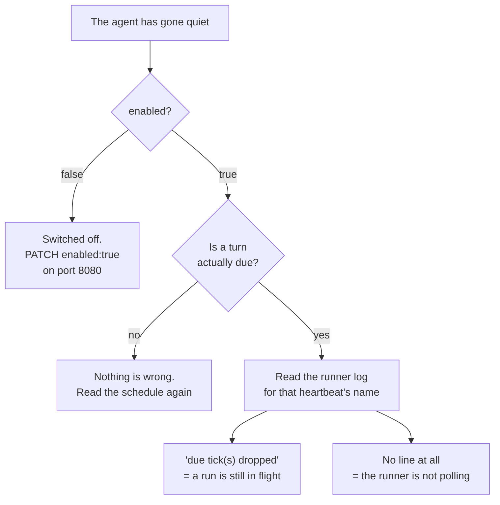

# How to find out why a heartbeat stopped firing

Goal: an agent that is meant to run on a schedule has gone quiet. Find out
which of the three possible causes it is, fix it, and confirm it fired.



## 1. Read the heartbeat records

```bash
curl -s http://agora.agents.svc.cluster.local:8080/heartbeats \
  | python3 -c "
import json, sys
for h in json.load(sys.stdin)['heartbeats']:
    print(h['name'], h['enabled'], h['schedule'], h['lastRunAt'], h.get('lastResult'))"
```

Three fields tell you almost everything (the
[heartbeat reference](/reference/agora-heartbeat) lists all of them):

- `enabled` — `false` means the runner never evaluates the schedule.
- `lastRunAt` — when the runner last **started** a run. Times are UTC here;
  schedules are read in Europe/Oslo.
- `lastResult` — one line on how the last run ended, such as
  `replied 1768 chars` or `failed: ...`.

## 2. If `enabled` is `false`, switch it back on

Use the **public** app on port 8080:

```bash
curl -X PATCH -H 'Content-Type: application/json' \
  -d '{"enabled": true}' \
  http://agora.agents.svc.cluster.local:8080/heartbeats/<id>
```

Do not send this to the internal app on 8081. Its `PATCH` is a different
handler that only reads the runner's bookkeeping fields. It answers
`200 {"status":"updated"}` and changes nothing.

If a heartbeat is off on purpose, put that in its name. Nova's own
`tools.heartbeat_health` check treats a heartbeat with `(disabled` in its
name as meant to be off. Any other heartbeat that is off gets reported.

## 3. If it is enabled, check whether a run is actually due

Work out when the schedule's next slot after `lastRunAt` was. The
[schedule grammar](/reference/agora-heartbeat#schedule-grammar) gives the
rules. For example, `cron@0 8 * * 2,5` fires on Tuesdays and Fridays at
08:00 Oslo time, so a `lastRunAt` from Friday morning is fine on a Monday.

If the slot is still in the future, nothing is wrong.

## 4. If a run is overdue, read the runner log

```bash
kubectl logs -n agents deploy/agora-persona-runner --since=2h \
  | grep 'heartbeat <name>:'
```

What you see decides the cause:

- **`starting run, N now in flight (limit M)`** — it did fire. The reply
  is still being written, or it failed. `lastResult` will say which once
  the run ends.
- **`N due tick(s) dropped since the last start (...)`** — the slot came
  due, but the heartbeat already had as many runs going as it is allowed.
  The reason in brackets names the limit. The next slot fires once a run
  finishes. Nothing needs fixing unless a run is stuck.
- **No line for that heartbeat at all** — the runner is not reaching it.
  Check the runner pod is `Running` and that it can read
  `GET /heartbeats` on the internal app.

## A `lastResult` stuck on `running` does not block anything

The runner writes `lastResult: "running"` when it starts a run and
overwrites it when the run ends. A run that is killed (a pod restart, for
example) leaves `running` in place for good.

That value is only a display. The runner decides whether a run is in
flight from its own threads, which a restart clears. So a stale `running`
does not stop the next slot from firing. It only means the old run's
result was never written.

## 5. Make it fire now, and confirm

```bash
curl -X POST http://agora.agents.svc.cluster.local:8080/heartbeats/<id>/run
```

The answer is `queued`, or `already-running` with a `runningSince` time.
"Run now" also works on a disabled heartbeat: the runner acts on
`forceRun` even when `enabled` is `false`.

Within one poll (5 seconds by default) `lastRunAt` should move to now and
the runner log should print `starting run`. Read step 1 again to see it.

## Related

- [Heartbeat reference](/reference/agora-heartbeat) — every field and
  route.
- [Give an agent a recurring job](/tutorials/scheduled-agent) — creating
  one from scratch.
- [How Agora runs an agent](/explanation/agora) — why there are two apps
  on two ports.
