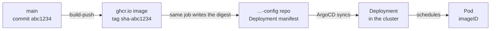

# Prove a merge is actually running

In this tutorial you will answer one question about this platform: **is the code on `main` the code the cluster is executing right now?**

It sounds like a question `kubectl get pods` answers. It is not. A pod can be `Running`, `1/1`, zero restarts, no errors in its log — and be running last week's code, because nothing crashed. Nothing was ever going to crash. The image simply never changed.

By the end you will have read the three facts that decide this, compared them by hand, found the one field that lies, and then run the single command that does all of it for you.



Every arrow is a separate system, and **every arrow can be the broken one while the two systems it joins both look healthy.**

**What you need**: a shell with `gh` and `kubectl` on it. Read-only access is enough — this tutorial changes nothing.

**Time**: about ten minutes.

## 1. Ask what the answer should be

Pick a repo whose image runs in the `agents` namespace. This tutorial uses `agora-persona-runner`; substitute your own and every command still works.

```bash
REPO=agora-persona-runner
gh api "repos/SokratesAI/$REPO/commits/main" --jq '.sha[:7]'
```

Write that short SHA down. It is the only thing in this tutorial you know for certain, and every other number you are about to read is a claim about it.

## 2. Read what the cluster was *told* to run

```bash
kubectl get deploy -n agents $REPO \
  -o jsonpath='{.spec.template.spec.containers[0].image}{"\n"}'
```

```
ghcr.io/sokratesai/agora-persona-runner@sha256:99ee27a9f43ddb206fa09f67d365394022118e91a6e922e02197571b53ce165c
```

Note what is **not** there: a tag. The Deployment pins an immutable digest, not `:latest` and not `:sha-abc1234`. That is deliberate, and it is why this question needs asking at all — a tag would silently follow the registry, and a digest never moves on its own. Somebody has to write a new one in, and "somebody" is a CI job that can fail.

## 3. Read what the cluster is *actually* running

```bash
POD=$(kubectl get pods -n agents -l app=$REPO \
  -o jsonpath='{.items[0].metadata.name}')
kubectl get pod -n agents $POD \
  -o jsonpath='{.status.containerStatuses[0].imageID}{"\n"}'
```

```
ghcr.io/sokratesai/agora-persona-runner@sha256:99ee27a9f43ddb206fa09f67d365394022118e91a6e922e02197571b53ce165c
```

Same digest as step 2, so this pod is running what the Deployment asks for. If they differ, the Deployment was updated and this pod predates it — the rollout is still in flight, or stuck.

:::danger The field next to it is not the same field
There is a `.image` beside that `.imageID`, and on a digest-pinned pod it holds a **different** `sha256:` value:

```bash
kubectl get pod -n agents $POD \
  -o jsonpath='{.status.containerStatuses[0].image}{"\n"}'
# sha256:93168b92b3472e71e3176d5cb0e04a281c0e9a9f35d023020156ca0ccd220bd2
```

That is the local image config ID, not the manifest digest the Deployment names. Compare it against step 2 and it will never match, on a healthy pod or a stale one alike — so a check built on it reports a problem every single time and therefore reports nothing. **`imageID` is the field that answers the question.**
:::

## 4. Join the two ends

You now have a commit at one end and a digest at the other, and nothing connecting them. The link is the tag the build pushed:

```bash
SHA=$(gh api "repos/SokratesAI/$REPO/commits/main" --jq '.sha[:7]')
gh api "orgs/SokratesAI/packages/container/$REPO/versions" \
  --jq ".[] | select(.metadata.container.tags[]? == \"sha-$SHA\") | .name" \
  | head -1
```

If that digest equals the one in steps 2 and 3, the answer is yes: `main` is what is running.

If it prints nothing, the image for that commit **does not exist** — the build never got as far as pushing. If it prints a digest that the Deployment does not carry, the image exists and nothing points at it: the build pushed and then failed to write the manifest into the `-config` repo. Those are two different failures with two different fixes, and from `kubectl get pods` they are indistinguishable, because in both cases the old pod keeps serving perfectly.

## 5. Now let the tool do it

Everything above is one command:

```bash
python3 -m tools.check_deploy $REPO
```

```
IN SYNC: main 5bb4df7 -> 99ee27a9f43d, manifest and 2 deployment(s) all agree. 2 pod(s) are running it.
```

It reads the same four facts you just read — tip commit, registry tag, manifest digest, live pod `imageID` — and names which arrow is broken when they disagree. It exits non-zero only when a human has something to do; a rollout still in progress is a normal state, not a fault.

Run it in a checkout of the repo it is asking about, so `gh` resolves the right remote.

## 6. What you learned

- **Green is not the same as current.** A healthy pod is evidence that a container starts, and evidence of nothing else.
- **Ask what you would have seen if the thing were broken.** For "the pod is running", the answer is *exactly the same output* — which makes it worthless as proof. The digest comparison is the check whose result could have gone either way.
- **Take a control reading.** Before believing a fix is live, read the digest *before* the merge as well. "The new digest is there" only means something next to "the old one was there a minute ago".
- **Two adjacent fields can mean different things.** `image` and `imageID` sit one line apart in the same object and only one of them answers this.

## Where next

- [How to revive a heartbeat](/how-to/revive-a-heartbeat) — for when the thing that is not running is a schedule rather than an image.
- [The Nova cycle](/explanation/nova-cycle) — why every cycle health-checks its own merge before it writes anything down.
