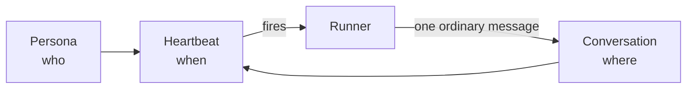

# Give an agent a recurring job

In this tutorial you will build an agent that wakes up on its own every
morning, reads a folder in your vault, and writes what it found into a chat
thread you can scroll back through.

You will build it out of three records, because Agora keeps *who*, *where*
and *when* separate. By the end you will have made all three, watched the
agent fire, and taken it apart again.



**What you need**: a shell inside the cluster that holds the Agora agent
token in `$AGORA_TOKEN` — the runner pod has both. Agora no longer has a web
front end (it was removed in agora#80), so every step here is one `curl`.

**Time**: about ten minutes. Nothing waits for the schedule — step 5 makes it
fire immediately.

:::note
Everything you create here is deleted again in step 6. Nothing in this
tutorial spends metered API credit as long as you pick the model in step 2 as
written.
:::

Set two variables first; every command below uses them:

```bash
A=http://agora.agents.svc.cluster.local:8080
H="x-agora-token: $AGORA_TOKEN"
```

Send the token on every call. Agora records any request to this port that
arrives without it, and it is on its way to refusing them.

## 1. Decide what the job actually is

Before creating anything, write one sentence describing the job as if you
were asking a colleague. Something narrow enough to be checkable, like:

> List the names of the files in the vault folder you were given, at most
> five, one line each.

Keep that sentence. It becomes the heartbeat's **task** in step 4, and
"narrow enough to be checkable" is what will let you tell whether this
worked.

## 2. Create the persona — the *who*

```bash
curl -s -H "$H" -H 'Content-Type: application/json' -X POST $A/personas -d '{
  "name": "Morning Sweeper",
  "personality": "You are terse. Report what you actually found and never pad.",
  "model": "claude-cli:claude-haiku-4-5-20251001",
  "capabilities": {"vaultRead": true, "webSearch": false}
}'
```

The answer is `{"status":"created","persona":{"id":"…", …}}`. Copy the `id`:

```bash
PERSONA=<the id you got back>
```

Two choices in that body matter more than they look.

**The model.** A model id is `"<provider>:<model id>"`. The `claude-cli:`
provider runs on a flat subscription; the `anthropic:` provider is billed per
token against a prepaid balance. They hold the same models, so the
subscription one costs you nothing in capability. An id that is not in
Agora's model catalog is refused with `400 unknown model`.

**The capabilities.** `personality` is the persona's standing instructions,
not the job. What it may *do* is `capabilities`, and the runner enforces
that from this saved record on every single turn, so anything you leave off
here is genuinely unavailable to it later. This agent needs to read the vault
and nothing more. The [persona reference](/reference/agora-persona#capabilities)
lists every grant.

## 3. Let the heartbeat make the conversation — the *where*

A conversation is an ordinary chat thread, and the agent's output will be an
ordinary message in it. You could create one with `POST /conversations`, but
the heartbeat can make an empty one for you in the same call, so you will do
that in the next step by passing `newConversationName`.

## 4. Create the heartbeat — the *when*

```bash
curl -s -H "$H" -H 'Content-Type: application/json' -X POST $A/heartbeats -d "{
  \"name\": \"Morning sweep\",
  \"personaId\": \"$PERSONA\",
  \"newConversationName\": \"Morning sweep\",
  \"schedule\": \"daily@07:00\",
  \"task\": \"List the names of the files in the vault folder you were given, at most five, one line each.\",
  \"vaultPaths\": [\"projects/sokrates/projects/agora/decisions/\"]
}"
```

The answer carries the heartbeat's `id` and the `conversationId` it just
created. Copy both:

```bash
HB=<heartbeat id>
CONV=<conversationId>
```

What each field does:

- **`schedule`** — `daily@07:00` is once a day at 07:00. Schedules are read in
  **Europe/Oslo** time. The [schedule grammar](/reference/agora-heartbeat#schedule-grammar)
  also has intervals (`every@6h`) and cron.
- **`task`** — the sentence from step 1. It is sent to the persona on every
  run.
- **`vaultPaths`** — read **fresh on every run**, not when you save. A
  trailing `/` means "everything under this folder"; without it the path is a
  single document.

## 5. Make it fire now

You do not have to wait until 07:00:

```bash
curl -s -H "$H" -X POST $A/heartbeats/$HB/run
```

It answers `"status":"queued"` and nothing seems to happen, and that is
correct. Agora does not push work to the runner — the runner polls. "Run now"
sets a flag, and the runner picks it up on its next poll.

Watch the heartbeat's result line:

```bash
curl -s -H "$H" $A/heartbeats | python3 -c "
import json, sys
for h in json.load(sys.stdin)['heartbeats']:
    if h['id'] == '$HB': print(h['lastResult'], h['lastRunAt'])"
```

Run it every few seconds. It says `running` while the turn is in progress,
then something like `replied 204 chars` — or `failed: …` with the reason.
The first run of this exact tutorial took 26 seconds.

Then read what the agent wrote:

```bash
curl -s -H "$H" $A/conversations/$CONV/messages | python3 -c "
import json, sys
for m in json.load(sys.stdin)['messages']:
    if not m.get('activity'): print(m['text'])"
```

The thread also records each tool call the agent made along the way — those
messages carry an `activity` field, and the filter above skips them. Drop the
`if` to see the agent looking up the folder before it answered.

### If it did not do what you wanted

Check them in this order, because each rules out the ones below it:

- **The result line says `failed:`** — the reason is in that line. A model or
  provider problem, most often.
- **The result line never changes** — check `enabled` on the heartbeat.
  Disabled heartbeats are never evaluated at all.
- **You pressed Run now twice and got one reply** — that is by design. The
  runner skips a heartbeat whose previous run is still going, and the second
  press answers `already-running` instead of `queued`. The guard is per
  heartbeat: two *different* heartbeats can run at the same time.
- **It replied, but ignored your folder** — check the trailing slash on the
  vault path, and check that `vaultRead` is on for the persona.
- **It replied, but rambled** — that is the persona's personality, not the
  task. Change it with `PATCH /personas/$PERSONA`; it changes everywhere that
  persona is used.

## 6. Take it apart

Delete the heartbeat first — it is the only one of the three that does
anything on its own. The other two are inert without it.

```bash
curl -s -H "$H" -X DELETE $A/heartbeats/$HB
curl -s -H "$H" -X DELETE $A/conversations/$CONV
curl -s -H "$H" -X DELETE $A/personas/$PERSONA
```

Each answers `200`. A `GET $A/personas/$PERSONA` afterwards answers `404`,
which is how you know it is gone.

Before you delete, some things worth trying, since they are what the
three-record split buys you:

- **Point the same schedule at a different persona** — `PATCH` the
  heartbeat's `personaId`. Same thread, same history.
- **Give the same persona a second schedule** — another heartbeat naming the
  same persona and a different conversation.

## What you learned

- A persona is *who*, a conversation is *where*, a heartbeat is *when*, and a
  heartbeat firing produces an ordinary message in an ordinary thread rather
  than some separate kind of output.
- Capabilities are granted on the persona and enforced by the runner from
  that saved record, so what you leave off is genuinely off.
- The provider prefix on a model id decides how the turn is billed.
- The runner polls; nothing pushes. "Run now" is a flag, not a trigger.

## Next

- [How Agora runs an agent](/explanation/agora) — why it is built this way,
  and what happens on the two ports.
- [Heartbeat reference](/reference/agora-heartbeat) — the full schedule
  grammar, including cron.
- [Persona reference](/reference/agora-persona) — every capability and what
  it grants.
- [Why a heartbeat stopped firing](/how-to/revive-a-heartbeat) — when the
  agent you built here goes quiet.
